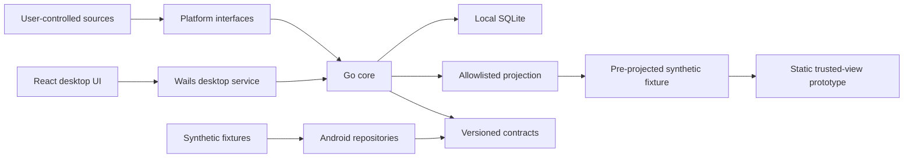

# Architecture

## Scope

Phase one is an executable, local-first scaffold. It demonstrates ingestion,
append-only correction, estimated sleep-wake phase, uncertain forecasts,
deterministic schedule proposals, and minimized trusted-view projection. It is
not a medical device and does not provide diagnosis or health recommendations.

The detailed analysis, optional-agent, validation, and UI specifications in
this directory are tracked against the scaffold in
[`specification-alignment.md`](specification-alignment.md). Versioned contracts
take precedence when terminology or field shapes differ.

## Components

### Go core

The core owns domain types, collectors' interfaces, persistence, effective
observation reads, estimation, scheduling, and sharing projection. It must not
import Wails or platform UI packages. Platform behavior is supplied through
interfaces and OS build tags.

### Desktop

The Wails service is an adapter over core use cases. It maps private domain
objects into explicit UI DTOs and does not expose database handles. The React
frontend communicates only through generated Wails bindings.

### Android

Android uses repositories whose return values conform to the shared contracts.
Fixture repositories support API 26. Real Health Connect access is isolated
behind an availability and permission boundary and requires API 28 or newer.
Android does not reimplement estimation in phase one.

### Trusted web prototype

The prototype is static and network-free. It reads only a pre-projected,
synthetic trusted-view fixture. It cannot access the private database or accept
arbitrary private-domain JSON.

## Data flow and invariants

1. Collectors append source observations with acquisition method and evidence
   status recorded independently.
2. Manual edits append correction records. Source observations are immutable.
3. An effective-read layer applies the latest valid correction chain.
4. Estimation selects recent principal sleep episodes and either emits an
   estimate with provenance, algorithm version, confidence, and uncertainty or
   returns a typed refusal.
5. Scheduling treats fixed events as immutable inputs and emits proposals with
   explanation codes.
6. Sharing projects private state through an explicit permission allowlist.
   Revoked or expired profiles produce no view.

## Time semantics

- Persist instants in UTC and store the originating IANA time-zone ID where
  local interpretation is required.
- Treat intervals as half-open `[start_at, end_at)`.
- Never infer cycles by grouping records at civil midnight.
- Time-zone database updates may change future local rendering; stored instants
  remain authoritative.

## Failure behavior

Missing permissions, unsupported contract versions, invalid correction chains,
ambiguous cycle indexing, and insufficient evidence fail closed. Estimation
refusal is expected domain behavior, not an exceptional success substitute.
Logs contain event categories and opaque IDs only, never sensitive payloads or
exact behavioral timestamps.
