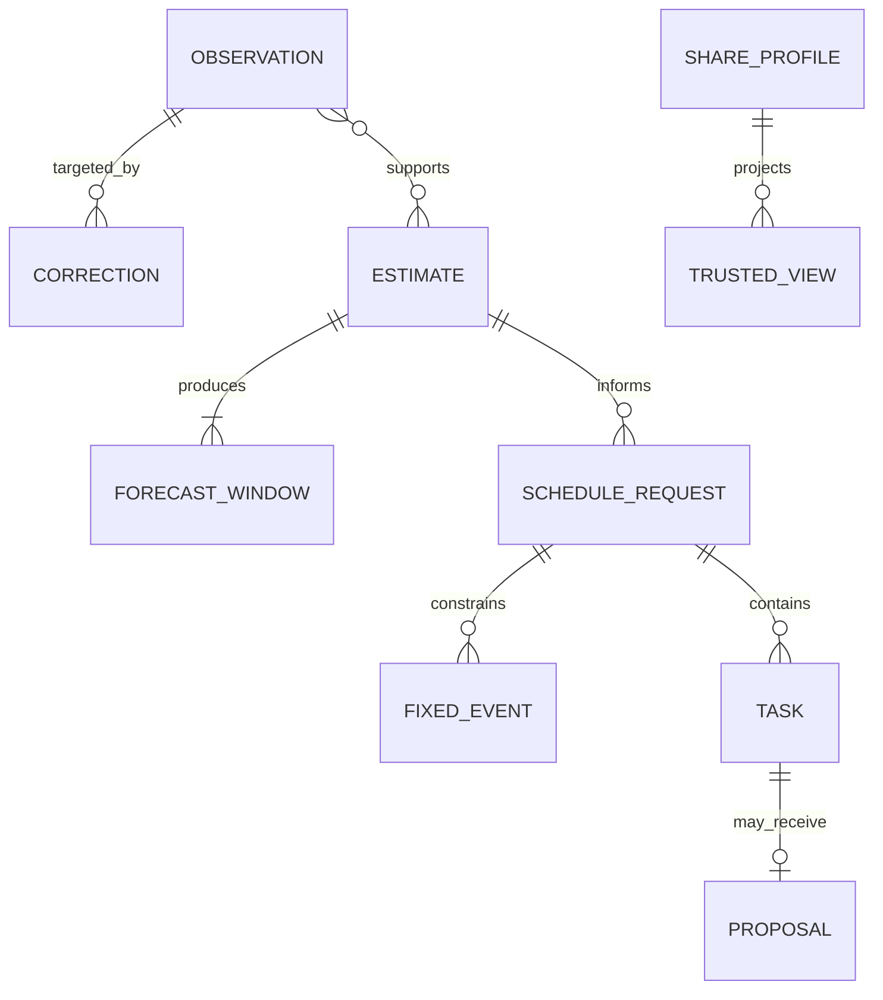

# Data model

## Conventions

- IDs are opaque and stable within the local store.
- Instants are UTC RFC 3339 values; applicable records also carry an IANA
  time-zone ID.
- Intervals are half-open.
- Imported evidence and correction history are append-only.
- Derived values carry creation time, algorithm version, confidence, and source
  support metadata.

## Private local entities

### Observation

An observation records an interval and kind such as principal sleep, nap, or
device activity. Provenance separates `acquisition_method` from
`evidence_status`; an imported measurement can therefore be directly observed,
while a manually entered value can be user reported.

Source observations are never updated after insertion. Import idempotency
reports an unchanged `source_record_id` before insertion and rejects a changed
payload using that ID. Semantic duplicates already stored are handled through
correction/effective-read state rather than destructive mutation.

### Correction

A correction targets an observation and changes one or more effective fields:
start, end, sleep classification, or exclusion. A later correction may
supersede an earlier correction. The read model validates the chain and retains
every prior record for auditability.

### Effective observation

This is a computed view, not a new source fact. It combines an immutable
observation with the latest valid correction chain. Estimation and user-facing
history read effective observations while provenance views can still show the
unaltered source.

### Estimate and forecast

An estimate stores observed sleep-start drift relative to 24 hours, median
sleep duration, support counts, algorithm version, and ordinal confidence with
reasons. Forecasts contain uncertain sleep and waking windows whose width grows
with horizon. The model does not claim exact circadian phase or DLMO.

A refusal stores a typed reason such as insufficient data, ambiguous cycle
indexing, or conflicting observations. Refusal and successful estimate are
mutually exclusive result variants.

### Fixed event, task, and proposal

Fixed events are immutable schedule constraints. Tasks contain duration and
allowed bounds. The scheduler returns proposal records with explanations and
never edits fixed events. User-entered timing constraints remain user-authored
inputs; the system does not turn them into medical recommendations.

### Share profile and trusted view

A share profile is private local state with lifecycle status, expiry, and an
explicit boolean permission for each projectable field. The trusted view is a
separate minimized DTO. It excludes private identifiers, provenance, location,
time-zone ID, raw observations/activity, health details, and calendar text.

## Storage relationships

The diagram is conceptual. Persistence may use join tables or serialized
reason lists, but ownership and immutability rules must remain unchanged.

## Contract mapping

Schemas under `contracts/v1/` describe interchange DTOs, not database rows.
Strict consumers reject unknown fields. A contract version change is required
when a strict v1 consumer would no longer accept or correctly interpret a
payload.
