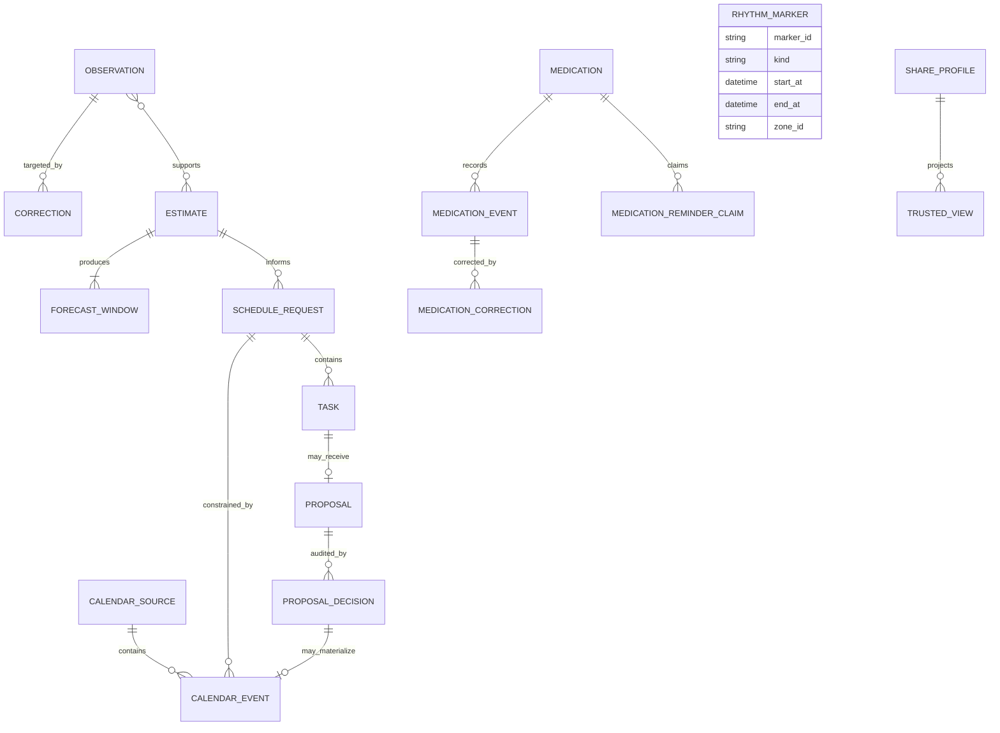

# Data model

## Conventions

- IDs are opaque and stable within the local store.
- Instants are UTC RFC 3339 values; applicable records also carry an IANA
  time-zone ID.
- Intervals are half-open.
- Imported evidence and correction history are append-only.
- Derived values carry creation time, algorithm version, confidence, and source
  support metadata.

## Private local entities

### Observation

An observation records an interval and kind such as principal sleep, nap, or
device activity. Provenance separates `acquisition_method` from
`evidence_status`; an imported measurement can therefore be directly observed,
while a manually entered value can be user reported.

Source observations are never updated after insertion. Import idempotency
reports an unchanged `source_record_id` before insertion and rejects a changed
payload using that ID. Semantic duplicates already stored are handled through
correction/effective-read state rather than destructive mutation.

### Correction

A correction targets an observation and changes one or more effective fields:
start, end, sleep classification, or exclusion. A later correction may
supersede an earlier correction. The read model validates the chain and retains
every prior record for auditability.

### Effective observation

This is a computed view, not a new source fact. It combines an immutable
observation with the latest valid correction chain. Estimation and user-facing
history read effective observations while provenance views can still show the
unaltered source.

### Estimate and forecast

An estimate stores observed sleep-start drift relative to 24 hours, median
sleep duration, support counts, algorithm version, and ordinal confidence with
reasons. Forecasts contain uncertain sleep and waking windows whose width grows
with horizon. The model does not claim exact circadian phase or DLMO.

A refusal stores a typed reason such as insufficient data, ambiguous cycle
indexing, or conflicting observations. Refusal and successful estimate are
mutually exclusive result variants.

### Calendar source and event

A calendar source has one of three ownership-bearing kinds: `ics` and `caldav`
are read-only imported snapshots; `zeitboard` contains only app-owned placement
blocks. An imported event retains local title, location, and notes for display,
but its scheduler projection contains only an opaque identifier and half-open
UTC interval. Snapshot replacement is atomic and imported rows cannot be
updated in place. Removing a source is explicit erasure, not an append-only
suppression.

### Medication definition, schedule, event, correction, and reminder claim

A medication definition is mutable private local intent with a monotonically
increasing revision. It stores a user-entered label, optional form/strength
text, optional verbatim clinician rule, active state, and an optional
user-authored schedule. Absence of a schedule is represented as absence, not
inferred as `as_needed`. An explicit schedule is `as_needed`,
`fixed_clock`, or `cycling`. Clock schedules own an IANA zone, one to
eight unique civil times, and an opt-in reminder flag; cycling schedules also
own a civil start date and on/off day counts. No field is inferred from a
medication label, event history, or sleep estimate.

A medication event is immutable evidence that the owner recorded `taken` or
`skipped` at a UTC instant with an IANA zone. An edit appends a correction that
may change effective time, zone, status, scheduled-elsewhere fact, note, or
exclusion. The chain has one root and cannot fork. Wake-relative and
before-sleep values are computed from current sleep evidence and are neither
stored in raw records nor exported. Exclusion retains evidence; hard deletion
is a separate typed operation that physically removes an event/corrections or
the definition and all dependent history.

A medication reminder claim is local delivery state, not health evidence. It
contains an opaque digest for one medication/scheduled-UTC occurrence, the
medication ID, and scheduled/claimed UTC instants. Its uniqueness and
immutability provide at-most-once desktop delivery across polling and restarts.
Claims are written before notification delivery, cascade on medication
erasure, and are excluded from contract export and sync.

### Rhythm context marker

A rhythm context marker is immutable, private, user-reported annotation data.
Its only kinds are `travel`, `illness`, `disruption`, and
`forced_schedule`. It stores a start instant, optional end instant, explicit
IANA zone, optional private note, and manual/user-reported provenance. It has
no correction chain and no update operation: a wrong record is hard-erased
with typed confirmation and replaced by a new append.

Markers are deliberately not estimator evidence. They never enter the sleep
session, estimate, scheduling, reminder, or proposal models. The desktop joins
them to actogram rows by structured civil date and exact IANA zone only for
display; it does not project a marker into an incompatible row clock. The
strict v1 export preserves the raw record and provenance; no sync,
trusted-view, MCP, or assistant projection exists.

### Task, proposal, and decision

Tasks contain duration and allowed bounds. The scheduler returns proposal
records with explanations and never edits fixed events. A local decision binds
the exact task revision, estimate, proposed interval, sleep-data fingerprint,
and text-free busy-event fingerprint. Approval appends a decision and creates a
separately owned ZeitBoard block in one transaction; rejection creates no
event. Undo appends an audit decision and removes only the linked app-owned
block. User-entered constraints remain user-authored inputs; the system does
not turn them into medical recommendations.

### Share profile and trusted view

A share profile is private local state with lifecycle status, expiry, and an
explicit boolean permission for each projectable field. The trusted view is a
separate minimized DTO. It excludes private identifiers, provenance, location,
time-zone ID, raw observations/activity, health details, and calendar text.

## Storage relationships

The diagram is conceptual. Persistence may use join tables or serialized
reason lists, but ownership and immutability rules must remain unchanged.

## Contract mapping

Schemas under `contracts/v1/` and `contracts/v2/` describe interchange
DTOs, not database rows. Strict consumers reject unknown fields. M-A medication
logging remains valid v1; M-B schedule fields use the medication v2 contracts
because strict v1 consumers would reject them. A contract version change is
required whenever an existing strict consumer would no longer accept or
correctly interpret a payload. Rhythm context markers use the independent
strict `contracts/v1/rhythm-marker-set.schema.json`; they do not extend the
strict rhythm-estimate or trusted-view contracts.
