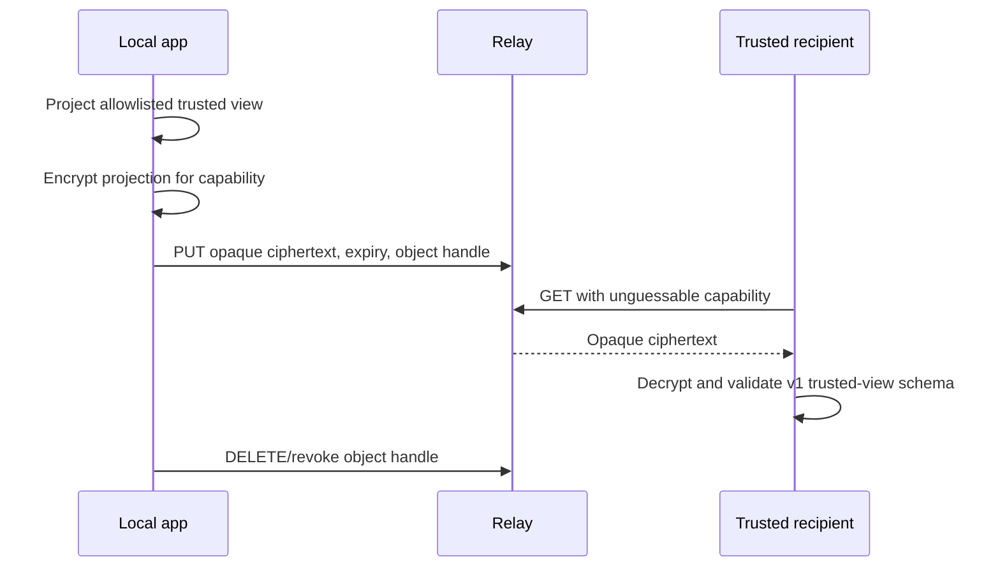

# Future relay design

## Status

Exploratory only. Phase one has no relay, public sharing endpoint, remote
account, or production trusted-view transport.

## Goals

- Transport only a minimized trusted-view projection selected by the user.
- Keep the local application authoritative for private data and permissions.
- Support expiry and revocation with small operational metadata exposure.
- Prevent the relay from learning observations, health details, provenance,
  calendar text, or private database identifiers.

## Non-goals

The relay is not a backup, synchronization engine, estimator, scheduler,
identity provider, analytics service, or source of medical guidance. It never
accepts the private domain model.

## Proposed boundary

The projection must occur before encryption and upload. Encryption cannot make
an over-broad payload acceptable.

## Capability and data model

- Generate a high-entropy object handle and a separate decryption secret.
- Place the decryption secret in the URL fragment so conforming HTTP clients do
  not send it to the relay.
- Store ciphertext, creation/expiry times rounded to a coarse bucket, schema
  version, and minimal abuse-control metadata.
- Authenticate mutation/revocation with a separate write capability.
- Enforce short maximum TTLs and delete expired ciphertext promptly.

The cryptographic construction and key lifecycle require specialist review
before implementation. Do not design a custom primitive.

## Revocation semantics

Relay deletion prevents future retrieval but cannot retract ciphertext or
plaintext already copied by a recipient. The UI must state this limitation.
Local profile revocation should delete the relay object immediately when
online, record pending deletion when offline, and stop all future publication.

## Metadata risks

Even opaque ciphertext can reveal IP addresses, object size, access timing, and
sharing relationships. Mitigations include fixed size buckets, coarse expiry,
minimal logs, short retention, rate limiting without advertising identifiers,
and no third-party analytics. A privacy review must decide whether stronger
network anonymity is necessary.

## Protocol checks

- Reject unsupported schema versions and oversized ciphertext.
- Bind version, expiry, and object handle as authenticated associated data.
- Use replay-safe conditional writes and idempotent deletion.
- Apply a restrictive content security policy and `no-referrer` behavior to a
  future recipient client.
- Keep relay availability failures distinct from local projection failures.

## Decision gates

Before implementation, approve an ADR covering cryptography, hosting region,
retention, abuse handling, legal/privacy obligations, recipient UX, independent
security review, and incident response. Update `privacy.md` and
`threat-model.md` in the same change.
